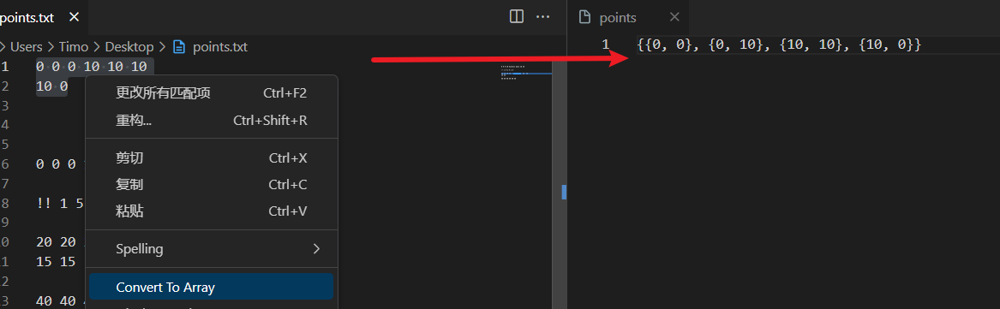
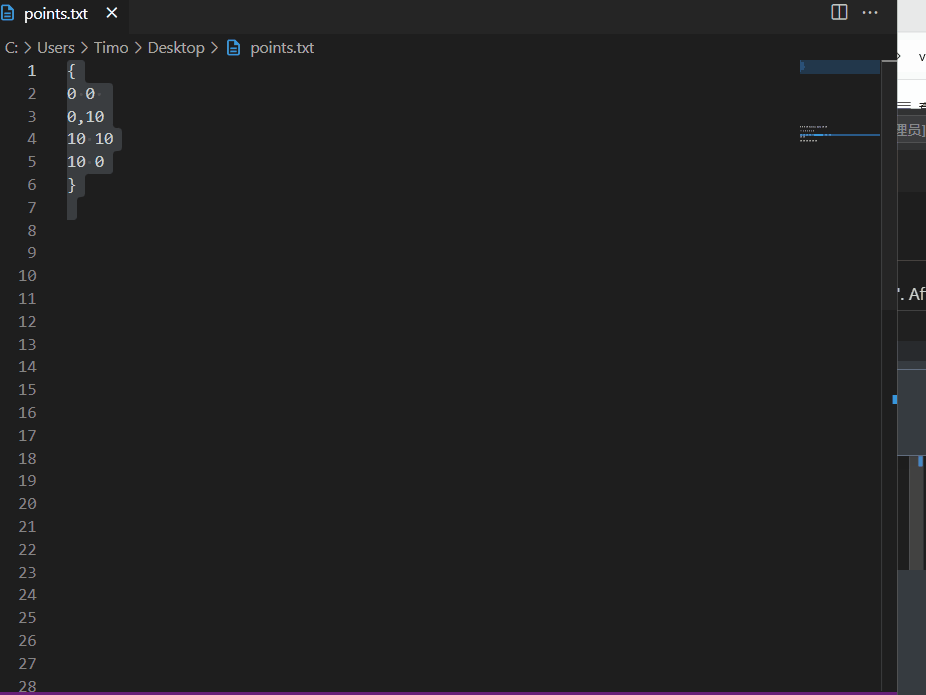
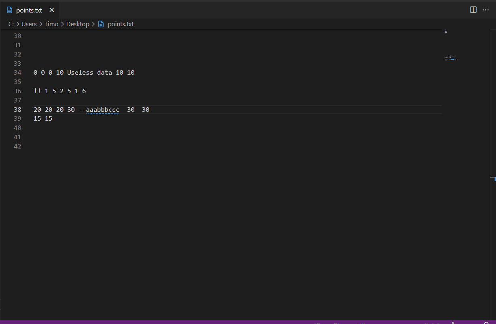

# polygon-view README

## Features

> Convert polygon data to array form

> Display of multi row point data for a single polygon

> Display of multiple polygons

## Release Notes

### 1.0.0

Initial release of polygon-view

---

**Enjoy!**
